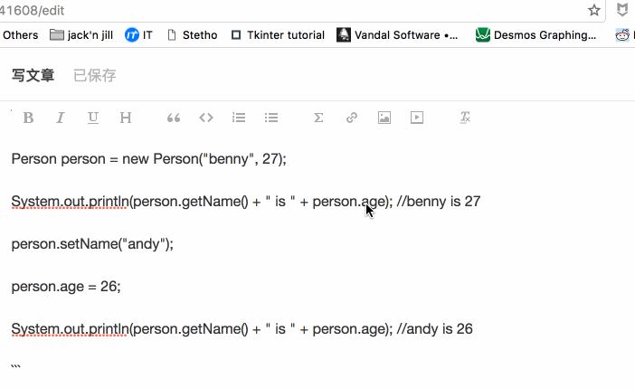

# 如何优雅的在微信公众号中编辑代码

这篇文章严格意义上是写给有公众号且公众号文章需要贴代码的朋友们看的。

## 1 公众号编辑器真难用

自从入坑公众号以来，被公众号的这个编辑器简直折磨死了。我发的文章基本上是少不了贴代码的，可是每次贴上去的代码总是被公众号的编辑器无厘头的给我过滤掉换行符，简直气死人。

例如我编辑得好好的代码，

```java
 Person person = new Person("benny", 27); 
 System.out.println(person.getName() + " is " + person.age); //benny is 27 
 person.setName("andy"); 
 person.age = 26; 
 System.out.println(person.getName() + " is " + person.age); //andy is 26 
```

贴上去就成了这样：

```java
 Person person = new Person("benny", 27);System.out.println(person.getName() + " is " + person.age); //benny is 27person.setName("andy");person.age = 26;System.out.println(person.getName() + " is " + person.age); //andy is 26 
```

每次一段代码一段代码的敲回车，简直敲到手抽筋。醉了。

这还不算，这个格式的代码发到手机上，还不能水平滚动，各种任性的折行，让本来清秀的代码看起来真是一坨一坨的。

## 2 分析下原因

查了一下，不少同行都在因为这个而感到苦恼，大家分析得出的结论是微信公众号的编辑器会对我们贴上去的内容进行处理，而处理的过程中又会对一些换行符进行过滤，导致本来排好的代码乱成一团。

## 3 几种常见的贴代码的方法

### 3.1 贴图法

对于这种情况，最直接的方法自然是用工具渲染好，然后截图贴到公众号的编辑器里面。也可以写一个工具把代码自动绘成图片。

* 优点：简单直接，在找到更好的办法之前，我之前的几篇文章都是这么处理的。
* 缺点：操作繁琐，除了生成图片或者截图，还要手动贴到公众号编辑器中，截图时对于代码的文字清晰度控制也不太容易，贴到编辑器之后，还会被压缩，导致代码不容易被看清楚。当然，另一个更大的硬伤就是读者阅读的时候会耗费比较多的流量，如果网速不好还会加载不出来。

### 3.2 Markdown Here

很多朋友都提到 Markdown Here，这是一个非常棒的 Chrome 插件，大家可以搜索并添加它，安装之后可以在 Options 当中选择自己喜欢的主题，之后只要在选中编辑框，贴入 Markdown 源码，再点击插件的按钮即可。



不过。。这个插件同样不能幸免于换行符的过滤，如果我们在微信公众号编辑器当中贴入 md 源码，按照上述操作渲染出漂亮的格式，保存之后预览，你就会发现这个办法其实并不怎么好用，或者说基本上不能用。

* 优点：这插件真的很棒。
* 缺点：因为渲染后的格式还是会惨遭微信公众号的编辑器的毒手，也就是说，你得自己手动处理一下换行的问题。

### 3.3 渲染好的格式直接贴

我们前面说，可以先把 md 源码渲染好，然后直接复制粘贴到公众号的编辑器当中，结果其实与 Markdown Here 的效果完全一样。说到底是换行符被过滤的问题。

我一直用的 md 工具是 MacDown，可以直接先用它编辑好文章，然后复制渲染结果贴到微信公众号当中，自行处理一下换行的问题即可。

* 优点：本地编辑，方便快捷。
* 缺点：一样，还是换行符的问题。

### 3.4 其他什么编辑器

当你在搜索引擎里面搜索这个问题的时候，大多数回答可能是推荐你用一些第三方的编辑器，比如 什么 135 编辑器之类的，这些编辑器对于不写代码的朋友来说，真的挺好用的，里面提供了各式各样的模板，大家只要把文字准备好，一套用就立马狂拽酷炫吊炸天。

可是，它们并不是为我们这些码农准备的啊，你想想公众号绝大多数的运营者都是编辑，而不是程序员，他们根本不需要关心什么是代码，更不需要关心怎么把代码排版好（我相信微信公众号编辑器的开发小伙伴大概也是这么想的吧，这么久了这编辑器还是这鬼样子）。

第三方编辑器很多，不过，当你一个一个去试的时候，你会发现这条路根本不通！！

* 优点：适合编辑各种花哨的文字和图片。
* 缺点：不支持代码的格式。

## 4 目前最优雅的方案诞生记

说实在的这个方案没有很高端。我们的痛点其实就是想个办法不让微信公众号编辑器对贴到里面的代码进行换行符的过滤。

有朋友提出把渲染后的结果每行都用 <br> 替换 \n，这样过滤时，换行自然就不会被干掉了。

```html
 <code class="hljs language-java" 
       style="...">Person person = <span class="hljs-keyword" style="color: rgb(170, 13, 145);">new</span> Person(<span 
         class="hljs-string" 
         style="color: rgb(196, 26, 22);">"benny"</span>, 
     <span class="hljs-number" style="color: rgb(28, 0, 207);">27</span>); 
     System.out.println(person.getName() + <span class="hljs-string" style="color: rgb(196, 26, 22);">" is "</span> + 
     person.age); <span class="hljs-comment" style="color: rgb(0, 106, 0);">//benny is 27</span> 
     person.setName(<span class="hljs-string" style="color: rgb(196, 26, 22);">"andy"</span>); 
     person.age = <span class="hljs-number" style="color: rgb(28, 0, 207);">26</span>; 
     System.out.println(person.getName() + <span class="hljs-string" style="color: rgb(196, 26, 22);">" is "</span> + 
     person.age); <span class="hljs-comment" style="color: rgb(0, 106, 0);">//andy is 26</span> 
 </code> 
```

这就是 md 渲染后的结果，代码对应于文章开头的例子。我们发现所有的代码被放到 code 这个标签当中，如果我们在其中用 <br> 替换 \n 会发生什么呢？

```java
 Person person = new Person("benny", 27); 
 System.out.println(person.getName() + " is " + person.age); //benny is 27 
 person.setName("andy");<br>person.age = 26; 
 System.out.println(person.getName() + " is " + person.age); //andy is 26 
```
```<br>``` 被直接显示出来了。根本不能用来换行。所以直接从结果入手好像没那么简单。那怎么办，我们干脆修改渲染方式吗？针对每行，用 ```<p />``` 标签包起来不就可以换行了吗？

想法挺好啊。想到这里我就开始准备去修改 Markdown Here 的源码了。。。可，尼玛，我不是搞前端的，一片一片的 js 代码我该修改哪里呢？这下可尴尬了。

此路通，可能成本还是有点儿高了。于是我又回到原点，思考如何欺骗微信公众号编辑器那个换行符不能被过滤的问题。怎么骗呢？关键是，公众号的编辑器通过识别怎样的 pattern 来过滤换行符呢？如果我找到这个 pattern，然后把它破坏掉，不就可以了么？

经过一番尝试发现：

* 每一行代码的前后各加一个空格，那么正常有内容的行末换行符就不会被过滤
* 空行替换成“英文空格+中文空格+英文空格”，这样在微信公众号编辑器看起来似乎不是空行，不过在我们看来其实是空行

于是我动手写了一个简单的 python 脚本，那么后续我只要用 MacDown 编辑好我的文章，再用下面这个脚本自动为所有的代码加上空格、替换空行，那么我再把渲染好的文章贴到公众号的话，大功就告成了。

附上非常简单的脚本代码：

```py
 #!/usr/local/bin/python 
 # encoding=utf-8 
 　 
 # 微信公众号编辑器对代码支持的不好, 我们在贴代码之前需要在代码前后各加一个空格 
 # 并对空行做一下处理,主要随便搞几个空格和制表符 
 # 这样做可以防止公众号的编辑器过滤空行和换行符 
 　 
 import sys, re 
 　 
 # 匹配 md 的代码起始块, 我习惯用 ```java 这样的形式, 也可以根据需求进行修改 
 CODE_PATTERN_START = r"^\s*```\s*\w*$" 
 # 匹配代码块结束, ``` 
 CODE_PATTERN_END = r"^\s*```\s*$" 
 if len(sys.argv) < 2: 
     print "参数不正确." 
     exit() 
 　 
 inputFile = open(sys.argv[1]) 
 output = [] 
 while True: 
     line = inputFile.readline() 
     if line: 
         if re.match(CODE_PATTERN_START, line): 
             output.append(line) 
             while True: 
                 line = inputFile.readline() 
                 if re.match(CODE_PATTERN_END, line): 
                     output.append(line) 
                     break 
                 if line.strip(): 
                     # 代码行前后各加一个空格 
                     line = " " + line 
                     line = line.replace("\n", " \n") 
                     print line 
                 else: 
                     print "空行" 
                     # 替换空行，下面的空格中有一个是中文空格 
                     line = " 　 \n" 
                 output.append(line) 
         else: 
             output.append(line) 
     else: 
         break 
 inputFile.close() 
 　 
 outputFile = open(sys.argv[1], 'w+') 
 outputFile.writelines(output) 
 outputFile.close() 
```

## 5 小结

这种方法应该算不上一个最终的方案（最终方案应该是公众号编辑器的开发该考虑的事儿），但它成本比较低，输出效果也比较不错，希望能给大家带来帮助。