# 高效地使用你的 IntelliJ

这个世界上，有些人是奥义·真·懒，他们懒得折腾一切，甚至懒得活，所以他们不会看到这篇文章的。还有些人是奥义·嘴上说的·懒，这些人有个特点，懒到什么事儿都要弄个工具，于是人类社会就这么被一点儿推动着前进了。看到这篇文章的大家应该都是后面的这类人，so，给自己鼓个掌吧！

话说，人懒就要用 IDE，IntelliJ 已经超神了，用的人越来越多，不过，它有这么多技能你们都用到过吗？

## 回车 or Tab？

很多时候我们在召唤出自动补全之后，光标选中了我们想要的那个选项，于是我们按回车。。。

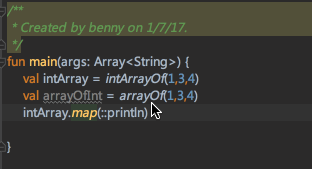

额。。这。。难道就不能直接替换掉那个 map 吗？！当然可以：


这操作有什么区别呢？前者按的是回车，后者按的是 Tab。

印象中，微软的东西都比较倾向于按 Tab 补全，比如 VS，再比如 Excel（Whaaaat?)，说这个也没别的意思，就是想让你记住，有时候 Tab 比回车好用。

## Swap 一下位置？

如果你飞快地写下了两句代码，然后发现他们的顺序是错的，你会怎么办？


选中一整行，剪切，然后粘到上一句的前面？你 Out 了！看我的！

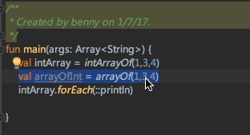

怎么做到的？很简单，打开你的设置，找到 keymap，再找到下面的几个 Action：

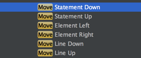

Statement 和 line 有时候会比较相似，比如我们刚才的情形；不过 Statement 还可以表示一整个函数或者类，于是你完全可以把光标放到一个函数的函数名上，然后 move up and down：

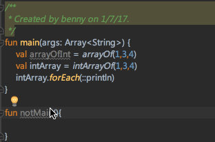

如果你觉得默认的快捷键不好使，自己定义一个，你开心就好。

## 想要不移动光标就换行？

经常遇到这种需求，我的光标在某一行的中间，这时候想要换行，于是。。


这明显有点儿尴尬。。当然你也可以直接移到行末，再回车，但总是要操作两次。其实这个也简单了，按住 shift 再回车，就可以直接换到下一行：


而按住 cmd+option 再按回车就直接换到上一行：

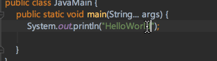

windows的快捷键我不知道，不过我还是要告诉大家它的名称，你自己定义就好：

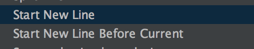

## 快速迭代一个集合或者数组？

如果你在 Kotlin 里面，可能并不会有这样的困惑，毕竟我们可以写完一个集合，然后 .map 就行了。Java 里面可不能这样，于是。。。

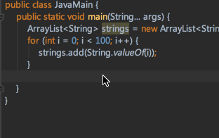

怎么办，怎么忍？让我们喊出我们的口号：不能忍！

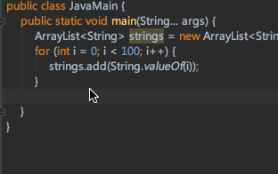

上面只要我们在打出一个集合之后，再打出 for，就能自动生成这段迭代的代码，这个叫做  Postfix。IntelliJ  支持了挺多的 Postfix，我就不一一列出了，在设置里面输入 postfix 那么你将看到 IntelliJ 支持的所有 Postfix：


## 多行编辑，哎哟小心某些人的钛合金眼~

多行编辑没什么神秘的，大家一看就明白了。第一种触发方式比较简单，按住 option或者alt，用鼠标往下拖就可以触发，例如：


第二种要高端一些了，比如我要修改个一个词，又不可以通过 refactor来统一修改，怎么办，难道有一百个还要让我改一百次吗？当然不需要，先选中第一个，然后如果是在Mac上，按 ctrl+G）选择下一个，或者直接 cmd+ctrl+G 选择全部，就如下图所示，选中之后，多行编辑触发，你就可以一下改掉所有的：

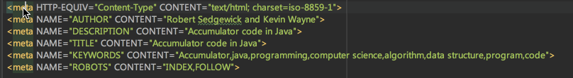

这里涉及到添加选择下一个和选择全部的操作，大家可以自己随意定义快捷键：


## 查找替换也有说法？

常规的查找替换肯定没啥可说的。不过不知道你注意到没，查找替换还有个 regex 的选项：

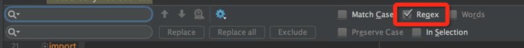

这个咋用呢？很简单，搜索词按照标准的正则表达式写就行了。比如我要定位到这个文件里面的所有函数名称，并在他们后面加一个 Test 方法，这种通常来说多行编辑是不太好做了，所以：

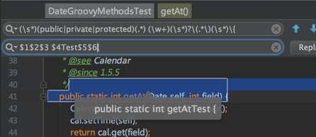

替换结果中，$n 表示第n个匹配到的元组。这个用起来对正则表达式的功底要求比较高了，当然我觉得他更有用的地方在于帮助你熟悉正则比倒是的用法。

## 最强快捷键，没有之一

我之前看谷歌大会的视频，有一哥们在操作几乎任何操作的时候都用到了一个类似于命令行的快捷键，看上去非常酷：

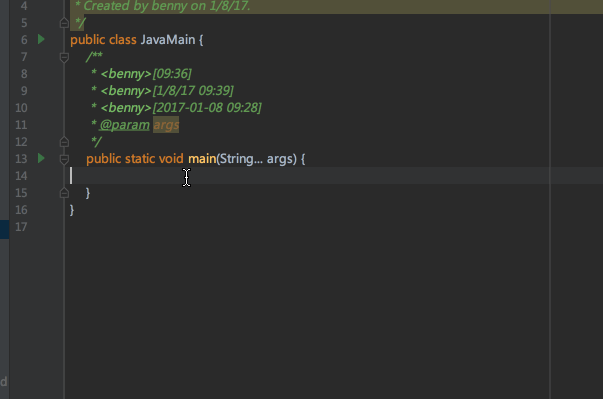

在这里，几乎可以输入任意操作，比如我们想要查看 Kotlin 的字节码，或者想要看下历史记录，甚至 make/run/debug，都毫无压力。

实际上，如果你对 IntelliJ 的插件开发有那么一丁点儿了解（比如我，虽然我自己没有写过= =、），你就会知道 IntelliJ 里面的各种操作都是 Action，只要是个 Action，就都可以配置快捷键，而且索引方式也是按照名称，所以前面的输入框就可以毫无压力的索引到这些 Action 了。

那么这个搜索框本身是个啥呢？它自己也是一个 Action，叫做：


给它配个快捷键，让你的 IntelliJ 起飞吧~

## 为什么输入 main 就能打出完整的 main 方法？

我在录制视频的时候经常会用一个比较快捷的输入方法：


输入main 之后就可以打出完整的main方法，这是怎么做到的？打开你的设置，找到 Live Templates，


新建一个 group 叫亚瑟：

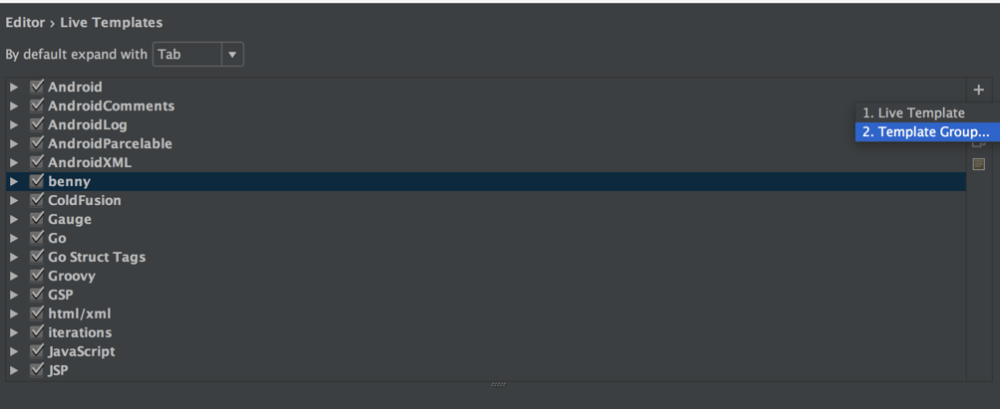

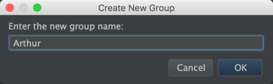

在这个 group 当中我们新建一个 Live Templates：

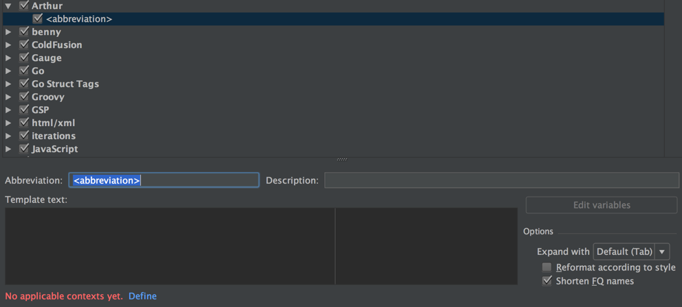

注意看，abbreviation 是缩写的意思，也就是说你将通过输入这段文字来触发模板，比如我们刚才的 main，我们现在想要方便的在注释中写下自己的名字和注释的时间，于是我们给他起个名字叫 "//"


description 就是一个注释的作用，所以不写也可以（虽然这并不是一个好习惯）。接下来我们要写 Template Text了。我们希望输入 // 之后能自动生成下面的代码：

```
<你的用户名>[当前时间] 
```

那么我们需要定义两个变量来代表 用户名和时间：

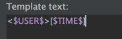

接下来我们要考虑，我们的这个模板用在哪里呢？


点击 Define，在弹出的菜单中选择 Java -> Comment：

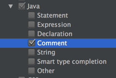

紧接着要给这两个变量赋值了，点击旁边的 Edit Variables：

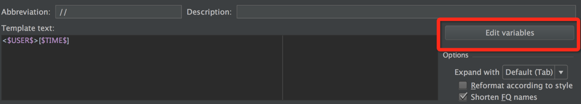

Expressions 有个下拉菜单，选出 user() 和 time() 赋给我们定义好的两个变量，同时勾上后面的两个勾 Skip if define——如果想知道为什么，你把勾去掉试试。

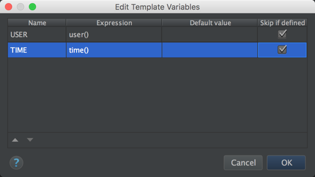

这样我们就创建好了一个新的模板，一路 OK之后，我们就可以试试了：


不过，你对时间格式有点儿不太满意，其实你还想要日期对不对？于是：


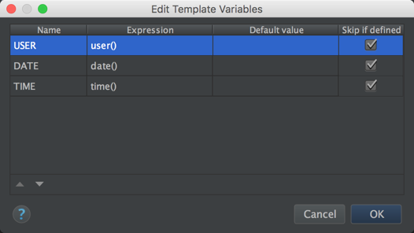

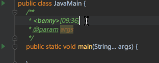

其实这样基本就满足需求了。如果你偏偏对此感到不满意，为什么时间的格式不能自定义，那。。我想告诉你的是，谁说不可以的。。

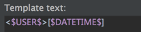

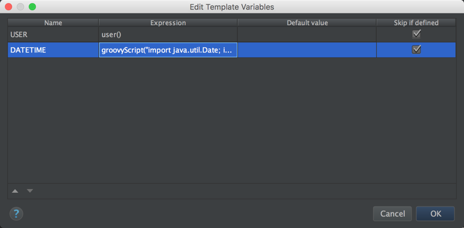

DATETIME 的表达式是：
```
groovyScript("import java.util.Date; import java.text.SimpleDateFormat; new SimpleDateFormat('yyyy-MM-dd HH:ss').format(new Date());")
```

就是一段普通的 groovy 脚本，不过由于 groovy 完全兼容 Java 语法，所以你可以写一段 Java 代码进入，最后一行的值就是表达式的值。

结果嘛：

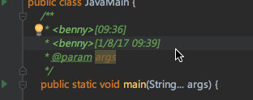

## 小结

当然 IntelliJ 当中好玩的东西不只这些，比如 最常用的 refactor等等，剩下的就需要大家自己去发现了，实在不行咱也可以写个插件或者去搜个别人做好的插件。IntelliJ 提供了很好的扩展性和定制性，每个人的背景和习惯不一样，对 IDE 的需求也不一样，只要肯折腾，这工具会越来越顺手的。
