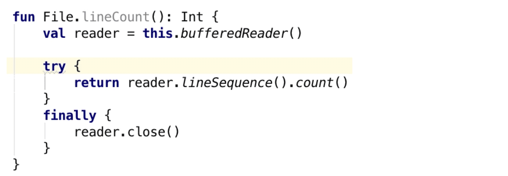

# Kotlin 1.0.6 

> 我把所有文章和视频都放到了 [Github](https://github.com/enbandari/Kotlin-Tutorials) 上 ，如果你喜欢，请给个 Star，谢谢~

在上周二，Kotlin 1.0.6 发布啦！这次更新主要是工具更新和bug修复。本文的内容主要来自[官方博客](https://blog.jetbrains.com/kotlin/)。

## IDE 插件的更新

* 1. try-finally 转换为 use() 

通常我们在进行 IO 操作的时候，我们并不希望异常影响我们程序的执行，所以我们需要对异常进行捕获，但捕获的话我们也没有必要处理，所以写下来的就是下面的形式：

```kotlin
try{
	... do something with "reader" ...
}finally{
	reader.close()
}
```
但这样写起来是不是非常的不流畅？如果用 use() 的话，简直一气呵成：

```kotlin
reader.use{
	reader -> ... do something with "reader" ...
}
```

所以，这次更新 Kotlin 的插件为我们带来了这样的自动转换功能：



* 2. 补全具名参数

通常我们在编写代码的时候，函数入参都会按照顺序一个一个传入，不过随着代码量的增加，特别是对于参数较多的函数，一长串的代码看上去会让我们感到非常的头疼。所以，这次更新 Kotlin 还为我们带来了自动补全具名参数的功能。


* 3. 删除空构造方法的声明
* 4. 合并声明和赋值
* 5. inline 函数的问题修复和调试工具的优化
* 6. 提示、KDoc 和 Quick Doc 相关的较多问题的修复

## Android 相关更新

* 支持 Android Studio 2.3 beta 1 和 Android Gradle Plugin 2.3.0-alpha3及更新的版本
* 增加 “Create XML resource” 的提示
* Android Extensions support 这个功能可以让我们很方便的引用 XML 布局的 View，不过这需要我们主动启用 'kotlin-android-extensions' 才行。在过去，即使不启用这个插件，IDE 也会允许我们直接引用 XML 布局的 View，但这并不能正常编译，所以这次更新修复了这个问题：只有启用了这个插件，IDE 才会允许我们引用对应的 View。
* Android Lint 相关的问题修复。
* 增加 Suppress Lint 提示。

## Kapt 优化

尽管还不能完全支持增量编译，相比 1.0.4，这次更新较大的提升了 Kapt 的性能。如果需要启用 Kapt，请在 gradle 当中启动它：```apply plugin: 'kotlin-kapt'```

## All-open 插件

我们知道 Kotlin 的所有类及其成员默认情况下都是 final 的，也就是说你想要继承一个类，就要不断得写各种 open。刚开始看到这一特性的时候，觉得很赞，它对培养良好的编码意识非常有帮助，不过它也在某些情况下给我们带来麻烦，比如在一些大量依赖继承和覆写的 Java 框架的使用中。

这一次 Kotlin 提供了一个妥协的办法，主要某个类被某一个特定注解标注，那么这个类就默认所有成员通通 open，省得一个一个写了。有关 allopen 的讨论，大家可以参考这里 [KEEP](https://github.com/Kotlin/KEEP/pull/40)。

那么 allopen 如何使用呢？

```groovy
buildscript {
    dependencies {
        classpath "org.jetbrains.kotlin:kotlin-allopen:$kotlin_version"
    }
}

apply plugin: "kotlin-allopen"

allOpen {
    annotation("com.your.Annotation")
}

buildscript {
    dependencies {
        classpath "org.jetbrains.kotlin:kotlin-allopen:$kotlin_version"
    }
}
 
apply plugin: "kotlin-allopen"
 
allOpen {
    annotation("com.your.Annotation")
}
```

那么所有被 com.your.Annotation 这个注解标注的类成员都会默认 open。除此之外，它还可以作为元注解使用：

```groovy
@com.your.Annotation
annotation class MyFrameworkAnnotation

@MyFrameworkAnnotation
class MyClass // will be all-open
```

Kotlin 还提供了 "kotlin-spring" 插件，其中包含了 spring 相关的所有注解，这样免得我们一个一个在 allopen 的配置中声明了。

## No-arg 插件

如果大家看过我的视频，一定对我之前提到的“毁三观”的实例化有印象吧，附上[视频连接：12 Json数据引发的血案](https://github.com/enbandari/Kotlin-Tutorials)，其中我们提到对于没有无参构造方法的 Kotlin 类，Gson 反序列化它们的时候，不知道如何实例化它们，只好用到了 ```Unsafe``` 这个类。听说 Java 9 要移除这个略显黑科技的类，如果是这样，Gson 是不是会被削弱呢？Java 的心我们还是不操了，从 Kotlin 1.0.6 开始，这个问题将得到一个比较好的解决。

```groovy
buildscript {
    dependencies {
        classpath "org.jetbrains.kotlin:kotlin-noarg:$kotlin_version"
    }
}

// Or "kotlin-jpa" for the Java Persistence API support
apply plugin: "kotlin-noarg"

noArg {
    annotation("com.your.Annotation")
}
```

类似于 allopen 的使用方法，如果某个类需要无参默认构造方法，你只需要用上面声明好的注解 com.your.Annotation 标注即可。当然，这个生成的默认构造方法只能通过反射调用。

## 如何更新

我一直觉得虽然我们出生就被选择了 Hard 模式，但我们没啥感觉啊。可是最近一直访问国外的网站，感觉真的好困难，宽带换成了电信 100M，下载 Kotlin 的插件仍然跟小水管一样，真也是没谁了。为了方便大家我把我下载的几个版本的插件放到[百度网盘](https://pan.baidu.com/s/1pLbb2fp)，供大家使用，请大家点击阅读原文获取下载地址。

## 小结

目前 Kotlin 1.0.x 的版本更新更侧重于稳定性和易用性，因此语言上的特性基本不会更新，主要集中于 IDE 插件和编译器插件。如果大家期待语言特性的更新，那我们就去关注一下 1.1 吧！

