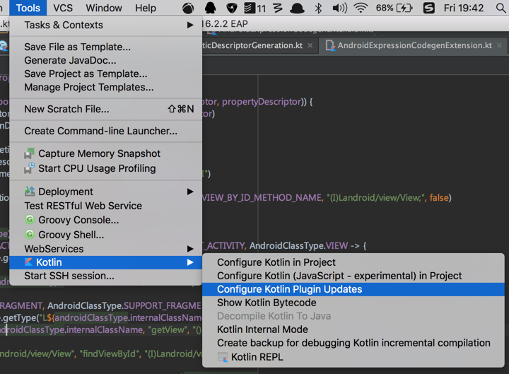

昨天 Kotlin 官方公布了一则消息：1.1 Beta 登场咯~用官方的原话就是说，这意味着正式版已经不再遥远，大家可以踊跃的试一试了~

这么好的消息，我自然不能藏着掖着，要赶紧给大家发一篇文章先介绍介绍。当然啦，我还没有来得及去仔仔细细尝试其中的各种特性，所以以下内容主要来自官网原文内容和 KEEP（也就是 Kotlin Evolution and Enhancement Process）的讨论。 

嗯，以后每周我们也可以考虑附加一篇 1.1 的尝鲜日志，有螃蟹就让我先吃吧，大家看着我吃哇咔咔咔！

# 0、注意事项

虽然官网没有提到，不过我还是想要强调一下，本文讨论的是 1.1 Beta！1.1 Beta ！！1.1 Beta！！！所以如果你装的是稳定版的 IDE 插件，并且在 gradle 当中配置的也是 1.0.6，就不要问『为什么我这个会报错』这样的问题了哦~~另外，如果真的会有这样的问题，我也不太建议大家去尝试 Bata 版，因为。。因为那样会比较打击人，你能忍受除了你自己写出bug之外还会有一些bug是因为语言本身有问题？

# 1、特性概览

## 1.1 协程

不得不说，1.1 还是给我们带来了不少的惊。。喜的，额，虽然我们一直都知道，最重要的就是 协程（Coroutines），话说我最早听说这个概念的时候还是在 Lua 和 Golang 当中，这个 Java 并不支持的特性，一直与我忽远忽近，后来听说 Kotlin 1.1M 还是考虑支持协程，我着实兴奋了一把。好吧，现在终于又近了一步。

协程实际上是一个处理并发调度的概念，非阻塞的异步调用对于有过动态语言开发经历的朋友可能已是司空见惯，而对于我们这些深山老林中的 Java 程序员来说，还真是一个新鲜玩意儿。是不是厌倦了你的 new Thread 和 callback？我们看看异步加载数据的代码在 Kotlin 1.1 下要怎么写：

```kotlin
future {
    val original = asyncLoadImage("...original...") // creates a Future
    val overlay = asyncLoadImage("...overlay...") // creates a Future
    ...
    // suspend while awaiting the loading of the images
    // then run `applyOverlay(...)` when they are both loaded
    return applyOverlay(original.await(), overlay.await())
}
```

看上去好像没什么特别的，不过请注意，orginal 和 overlay 可都是异步加载的，applyOverlay 方法的调用会等到二者都准备好之后。

看上去非常符合人的思维，你不用再去过分 care 调用时序的问题，这些都交给虚拟机好了。有关协程的详细介绍，大家也可以看一下这里[Coroutines for Kotlin (Revision 3)](https://github.com/Kotlin/kotlin-coroutines/blob/master/kotlin-coroutines-informal.md)，我后续的推送当中也会逐渐推送相关内容。

## 1.2 类型别名

其实很多时候我们都需要一个类型来表示多种不同的含义，比如对于一个音乐播放器来说，在随机模式下，一首歌在播放列表的位置就有两种：实际位置，播放位置。这两种位置其实都是可以用一个 int 来表示的，于是我们的代码就会写成：

```kotlin
fun getPosition(): Int{
    ...
}
```

不知道大家发现什么没有，这个方法这么看上去我们根本搞不清楚它要返回的是那种类型的位置。如果有了类型别名呢？

```kotlin
typealias ListPosition = Int

fun getPosition(): ListPosition{
    ...
}
```

虽然返回的仍然是整型，不过含义却明确了许多。

当然，除了这个用途之外，对于 Lambda 表达式的表示也会简洁直接许多。

```kotlin
typealias Callable = ()->Unit
```
## 1.3 Bound callable references

说这个之前，我们先看个例子：

```kotlin
array.map(::println)
```
这个很显然是遍历 array，并调用函数 println 打印每一个元素。

那么问题来了，假设，现在我不用控制台打印了，我要将元素打印到 PDF 上面，于是：

```kotlin
array.map{
    pdfPrinter.println(it)
}
```
那么可不可以简化呢？

```kotlin
array.map(pdfPrinter::println)
```

也就是说函数引用进一步支持了绑定调用者（或者 receiver）的情况。

## 1.4 Data class 可以有爸爸啦

以前，data class 是不允许继承其他类的。不要问我为什么，没有父类这种事儿我更建议你去问问猴子。


> 你丫再瞎说小心我削你啊

不过，1.1 开始，Kotlin 的创造者们终于良心发现，允许 data class 有个爸爸，这种事儿嘛，终归是一幅令人感动的画面啦。

```kotlin
data class Complex(...) : Something()
```

不过嘛，data class 这个家伙还是有点儿悲剧的，1.1 也没有允许他有子嗣，虽然可以认爹，不过没爹的时候就继续自己孤苦着吧。

## 1.5 放宽 sealed class 的子类定义限制

sealed class 的子类必须同时也是它的内部类，这即将成为过去。从 1.1 开始，只要跟 sealed class 定义在同一个文件内即可，嗯。。这个功能没有什么逻辑上的变化，不过写起来倒是省力一些。

## 1.6 万金油下划线

不知道大家有没有注意过 Golang 当中的下划线，

```go
_,err := func()
```
其实就是个占位符，如果我们对它不是很关心，那么还用得着费尽心思给它想个名字吗？当然不，Kotlin 1.1 也允许你这么干：

```kotlin
val (_, x, _, z) = listOf(1, 2, 3, 4)
print(x + z)
```

上面这个例子，我们只关心第2、4个值，1、3就直接忽视好了。

```kotlin
var name: String by Delegates.observable("no name") {
    _, oldValue, _ -> println("$oldValue")
}
```
这个例子则是说，三个形参我只关心第二个，那么其他两个退下吧~

哈哈，如果不需要我思考给变量起什么名字的话，我会不会轻松很多！

## 1.7 provideDelegate

不知道大家有没有想过，一旦给一个成员加了 Delegate，那么我就把这个成员的控制权交给了 Delegate，如果我想要监听一下这个成员的读写，我只能在 Delegate 当中做了。

```kotlin
class ResourceLoader<T>(id: ResourceID<T>) {
    operator fun provideDelegate(thisRef: MyUI, property: KProperty<*>)
        : ReadOnlyProperty<MyUI, T> {
        checkProperty(thisRef, property.name)
        ... // property creation
    }
 
    private fun checkProperty(thisRef: MyUI, name: String) { ... }
}
 
fun <T> bindResource(id: ResourceID<T>): ResourceLoader<T> { ... }
 
class MyUI {
    val image by bindResource(ResourceID.image_id)
    val text by bindResource(ResourceID.text_id)
}
```

provideDelegate 可以允许我们在配置了 Delegate 之后也可以做一些织入代码的工作，这就为 Delegate 带来了更多的灵活性。

## 1.8 其他特性

当然，1.1 这么大的版本，特性肯定不止这些了，还有一些特性比如 DSL 作用域控制、为 Kotlin 集合增加 Java 8 方法的支持等等，我这里就不一一介绍了，大家也可以直接到[官博](https://blog.jetbrains.com/kotlin/2017/01/kotlin-1-1-beta-is-here)一探究竟。


# 2 如何配置 1.1 的环境

如果你也想吃螃蟹，那你必须更新你的 Kotlin 插件版本：




选中 1.1 之后点击 check for update 就可以了。

如果你用 gradle 或者 maven 构建自己的工程，那么你需要添加插件仓库：http://dl.bintray.com/kotlin/kotlin-eap-1.1，选择 Kotlin 的版本为 1.1.0-beta-17 即可。

下面是 gradle 的配置：

```groovy
buildscript {
    ext.kotlin_version = '1.1.0-beta-17'

    repositories {
        jcenter()

        maven{
            url "http://dl.bintray.com/kotlin/kotlin-eap-1.1"
        }
    }
    dependencies {
        classpath "org.jetbrains.kotlin:kotlin-gradle-plugin:$kotlin_version"
    }
}
```

# 3 小结

Kotlin 的迭代速度还是非常快的，稳定版本基本上每两个月更新一次，1.1 版的开发工作从年初正式版发布就逐渐为人所知，终于 Beta 来了，相信 1.1 正式版也不会让我们等太久。

后续我也会陆续推送一些文章介绍 1.1 的新特性，希望大家多多关注~