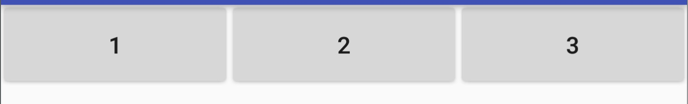
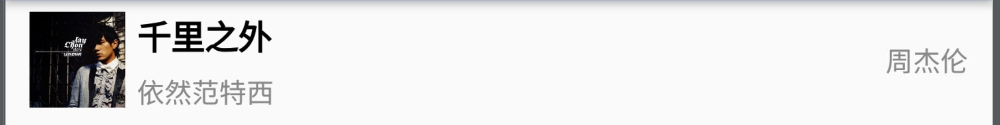

# [用 Kotlin 写 Android] 02 说说 Anko

上周的文章其实我们提到了 Anko 的，不过我们只是给大家展示了一下 find 方法。除了这个之外，还有哪些好玩的东西呢？

## 1、简化页面操作

我们写 Android 最先做的是什么？当然是设置个 OnClickLisener，这样自然我的按钮听我的，我的地盘我做主了。

```kotlin
hello.onClick {
    startActivity<AnotherActivity>("from" to "MainActivity")
}
```

哎哟，不错哦。其中 hello 是一个 TextView，我们通过 onClick 为其设置了一个 OnClickListener，这样看上去真是简洁不少。

```kotlin
fun android.view.View.onClick(l: (v: android.view.View?) -> Unit) {
    setOnClickListener(l)
}
```
也没什么难理解的，onClick 是一个扩展方法，传入的 Lambda 表达式通过 SAM 转换成了 OnClickListener，一切都是这么的自然。如果你对传入的 view 感兴趣，你当然可以直接用 it 召唤它：

```kotlin
hello.onClick {
	Log.d(TAG, it.toString())
    startActivity<AnotherActivity>("from" to "MainActivity")
}
```
简单吧。

**等等！那个 startActivity 是怎么回事？没有 Intent 么？**

哈哈，这个嘛，且看源码：

```kotlin
inline fun <reified T: Activity> Context.startActivity(vararg params: Pair<String, Any>) {
    AnkoInternals.internalStartActivity(this, T::class.java, params)
}

...

fun internalStartActivity(
        ctx: Context,
        activity: Class<out Activity>,
        params: Array<out Pair<String, Any>>
) {
    ctx.startActivity(createIntent(ctx, activity, params))
}
```
其实也没什么，就是对我们之前模板式的跳转写法做了简化而已，至于用到的 reified 和 Pair 也不算什么新鲜的东西，Pair 当中的 K-V 实际上就是我们通常放入 Intent 的 extra，所以我们自然可以在 AnotherActivity 当中取到这个值：

```kotlin
class AnotherActivity: AppCompatActivity() {
    override fun onCreate(savedInstanceState: Bundle?) {
        super.onCreate(savedInstanceState)
        relativeLayout {
            textView {
                text = if(intent == null) 
                			"from nowhere" 
	                	else 
   		             		intent.extras["from"]?.toString()
            }
        }
    }
}
```

取到我们传入的值，在 AnotherActivity 当中显示出来。有木有觉得要比我们用 Java 老大哥写出来的代码简洁易懂呢？

## 2、聊聊 DSL 布局

**再等等！那个 ```relativeLayout{...}```是几个意思？？**

嗯，这个要多说几句了，Anko 这个框架虽然打着简化开发的旗号，不过野心终归还是不小的。它自己搞出一套用 Kotlin 写布局的 DSL，换句话说，有了 Anko 我们布局甚至可以不需要用 XML 了，也不需要像用 Java 硬编码 View 那么繁琐，只需要通过几句 DSL 就可以搞定。我们来多看几个例子：

### 2.1 水平布局

下面是是三个按钮水平等分布局的写法，我们用到的实际上就是线性布局，比较简单，button 的参数是按钮的文字（有较多重载的版本，大家可以酌情选择），lparams 的参数有三个，前两个分别是宽、高，最后一个是一个 Lambda 表达式，我们可以在这个Lambda表达式当中详细定义我们需要的布局，比如设置 margin 等等。

```kotlin
linearLayout {
    button("1").lparams(wrapContent, wrapContent){
        weight = 1f
    }
    button("2").lparams(wrapContent, wrapContent){
        weight = 1f
    }
    button("3").lparams(wrapContent, wrapContent){
        weight = 1f
    }
}
```
效果图如下：



### 2.2 纵向布局

还是线性布局，不过换了个方向，你当然可以这么写：

```kotlin
linearLayout {
    orientation = LinearLayout.VERTICAL
    button("1").lparams(wrapContent, wrapContent){
        weight = 1f
    }
    button("2").lparams(wrapContent, wrapContent){
        weight = 1f
    }
    button("3").lparams(wrapContent, wrapContent){
        weight = 1f
    }
}
```
不过，Anko 更倾向于让我们用这个：

```kotlin
verticalLayout {
    button("1").lparams(wrapContent, wrapContent){
        weight = 1f
    }
    button("2").lparams(wrapContent, wrapContent){
        weight = 1f
    }
    button("3").lparams(wrapContent, wrapContent){
        weight = 1f
    }
}
```

我给大家看一下源码，大家就分分钟明白了：

```kotlin
val VERTICAL_LAYOUT_FACTORY = { ctx: Context ->
    val view = _LinearLayout(ctx)
    view.orientation = LinearLayout.VERTICAL
    view
}
```
其实我们创建的 verticalLayout 最终是从这个方法当中获取的，没啥新鲜的，就是设置了一下 orientation 罢了。效果图我就不贴了，大家很容易猜得到。

### 2.3 相对布局

```kotlin
relativeLayout {
    relativeLayout {
        textView("周杰伦") {
            id = R.id.extra
            useSecondary()
        }.lparams(wrapContent, wrapContent) {
            alignParentRight()
            centerVertically()
            rightMargin = dip(10)
        }

        imageView {
            id = R.id.avatar
            imageResource = R.drawable.jaychow
            scaleType = ImageView.ScaleType.FIT_XY
        }.lparams(dip(40), dip(40)){
            centerVertically()
            leftMargin = dip(10)
        }

        textView("千里之外") {
            id = R.id.title
            usePrimary()
        }.lparams(matchParent, wrapContent) {
            leftOf(R.id.extra)
            rightOf(R.id.avatar)
            margin = dip(5)
        }

        textView("依然范特西") {
            id = R.id.subtitle
            useSecondary()
        }.lparams(matchParent, wrapContent) {
            leftOf(R.id.extra)
            rightOf(R.id.avatar)
            below(R.id.title)
            leftMargin = dip(5)
        }
    }.lparams(matchParent, dip(50))
}
```

```xml
<?xml version="1.0" encoding="utf-8"?>
<resources>
    <item name="title" type="id"/>
    <item name="subtitle" type="id"/>
    <item name="extra" type="id"/>
    <item name="avatar" type="id"/>
</resources>
```

这个布局我们看到其实就是一张图片，三个 TextView，难度也不大，不过这种写法可能要适应一下。

效果如下：



注意到我在 TextView 当中用了两个方法：usePrimary() 和 useSecondary()，这其实是我定义的样式：

```kotlin
fun TextView.usePrimary(){
    textSize = 15f //注意这里就是 sp 的值
    textColor = Color.BLACK
    typeface = Typeface.DEFAULT_BOLD
}

fun TextView.useSecondary(){
    textSize = 12f //注意这里就是 sp 的值
    textColor = Color.GRAY
}
```
这个算是比较复杂的一个布局了，只要 XML 可以搞定的用 Anko DSL 的方式一样可以搞定，而且写出来的东西都可以直接对应到源码，这一点是非常棒的。我们在使用 XML 布局的时候如果想要知道某一个属性对应 View 的什么成员，还得去找这个 View 解析 XML 的代码，显然这一点 DSL 要方便一些。

### 2.4 独立的 UI 

前面我们说到的都是在 Activity 的 onCreate 方法中使用 DSL 的场景。很多时候我们其实还是希望布局和 Activity 分开的，那么我们就可以用官方推荐的这种方式来给 Activity 设置布局：

```kotlin
class MyActivity : AppCompatActivity() {
    override fun onCreate(savedInstanceState: Bundle?, persistentState: PersistableBundle?) {
        super.onCreate(savedInstanceState, persistentState)
        MyActivityUI().setContentView(this)
    }
}

class MyActivityUI : AnkoComponent<MyActivity> {
    override fun createView(ui: AnkoContext<MyActivity>) = with(ui) {
        verticalLayout {
            val name = editText()
            button("Say Hello") {
                onClick { ctx.toast("Hello, ${name.text}!") }
            }
        }
    }
}
```

### 2.5 在任意位置用 DSL 定义 View

前面提到的各种 ```relativeLayout {}``` 也好，```verticalLayout {}``` 也好，都只能在 Activity、ViewManager（ViewGroup 的接口）、Context 这三个类的作用域范围之内使用，换句话说前面的几个布局的方法都是这几个类的扩展方法。

下面这个写法是没有问题的：

```kotlin
fun createView(context: Context): View{
	return context.relativeLayout{
		...
	}
}
```
相应的，我们可以用任意一个 ViewGroup 的子类来调用类似的方法，这与调用 ```viewRoot.addView(FrameLayout(viewRoot.context))``` 是一样的：

```kotlin
fun addViewToParent(viewRoot: ViewGroup){
    viewRoot.frameLayout { 
        ...
    }
}
```

如果是在 Fragment 当中，Anko 还非常贴心的定义了一个叫 UI 的方法，这个方法同时也存在于 Context 当中，用法也比较简单：

```kotlin
class MainFragment: Fragment(){
    override fun onCreateView(
            inflater: LayoutInflater?, 
            container: ViewGroup?, 
            savedInstanceState: Bundle?): View {
        return UI {
            tableLayout { 
                ...
            }
        }.view
    }
}
```

### 2.6 扩展 Anko，支持自定义 View

我们在开发中经常继承一个 View 实现一些自己想要的功能，比如我们继承 _RelativeLayout:

```kotlin
class CustomLayout(context: Context)
    : _RelativeLayout(context) {
 	...   
}
```

注意，如果我们直接继承 RelativeLayout，那么还需要自己定义 lparams 方法，这个我就不细说了，大家有需求可以自己详细研究~

为了让 Anko DSL 支持下面的写法：

```kotlin
customLayout{
	button("ClickMe"){ ... }
}
```

我们需要定义下面三组扩展方法：

```kotlin
inline fun ViewManager.customLayout(theme: Int = 0) 
        = customLayout(theme) {}
inline fun ViewManager.customLayout(
        theme: Int = 0, 
        init: CustomLayout.() -> Unit) 
        = ankoView(::CustomLayout, theme, init)

inline fun Activity.customLayout(theme: Int = 0) 
        = customLayout(theme) {}
inline fun Activity.customLayout(
        theme: Int = 0, 
        init: CustomLayout.() -> Unit) 
        = ankoView(::CustomLayout, theme, init)

inline fun Context.customLayout(theme: Int = 0) 
        = customLayout(theme) {}
inline fun Context.customLayout(
        theme: Int = 0, 
        init: CustomLayout.() -> Unit) 
        = ankoView(::CustomLayout, theme, init)

```

其中，第一组 ViewManager 的是为了在 ViewGroup 当中使用；第二组是为了在 Activity 当中使用，第三组就是为了在所有 Context 当中使用。

扩展也是非常简单的，用起来也丝毫感觉不到这些 View 是自定义的，比起 XML 标签长长的一串确实也要美观得多。

```xml
<net.println.kotlinandroiddemo.CustomLayout
    android:layout_width="match_parent"
    android:layout_height="match_parent">
		...
</net.println.kotlinandroiddemo.CustomLayout>
```

### 2.7 Anko DSL 使用小结

Anko DSL 的方式布局看上去还是比较清爽直观的，而且因为这是 Kotlin 代码，自然所有的view 都是强类型约束的，不需要我们 findViewById 再强转，除此之外由于是代码，可以直接运行，也就省去了运行时解析 XML 的开销，这一点可以说也是相比于 Android 官方的 XML 布局而言 Anko 主打的性能优势。

它的各方面优势我们在前面已经给大家一一点到，可是它存在哪些问题呢？

* 首先，Anko DSL 布局不能预览。可以说这一点足以让我们放弃它了，不能预览的话很多时候我们只能通过运行结果来判断布局是否准确，这对开发效率的影响是巨大的。当然，这么说可能 Anko 不服，毕竟人家也是发布了一个叫 Anko Preview Plugin 的 IDE 插件的，有了这个插件理论上我们就可以预览 Anko DSL 的布局结果了对吧？可是结果呢，每次做了修改都需要 make 一下才可以看到结果，显然预览速度来看不如 XML 快。而就算这个问题我们可以忍，慢就慢点儿，别慢太多就行了吧，结果呢，人家这个插件存在各种各样的问题，比如对最新版的 Android Studio 2.2 和 IntelliJ 2016.3 不支持（当然其实本质上是对新版本的 Preview 功能不兼容），大家可以参考这个 issue：[https://github.com/Kotlin/anko/issues/202](https://github.com/Kotlin/anko/issues/202)。也就是说，这个插件现在是不能用的，所以跟没有也没啥区别。
* 其次，对于 id 的定义会比较蛋疼。我们知道我们在布局的时候可以通过 ```@+id/xxx``` 的方式生成一个 id，并交给 Android 资源管理器统一管理，用 Anko DSL 的话我们就得专门定义一个变量或者在 value 目录下面增加 id 的定义（就像 2.3 的例子那样）去让 view 引用。不用 id 行不行呢？你去问问 RelativeLayout 答应不答应吧。
	
	```kotlin
    val FROM_TEXT = 0
    val CLICK_ME = 1
    relativeLayout {
        textView {
            text = ...
            id = FROM_TEXT
        }
        
        button("clickMe"){
            id = CLICK_ME
        }.lparams { 
            below(FROM_TEXT)
        }
    }
	```
* 再次，我们通常会需要引用一些 view，通过 XML 布局 + kotlin-android-extensions 的方式，我们可以直接引用到这些有 id 的 view，非常方便，不过，如果我们用 Anko DSL 布局的话，我们就享受不到这项福利了（如果你不明白为什么，可以去看下我的[前一篇文章: 用Kotlin写Android 01 难道只有环境搭建这么简单？](http://mp.weixin.qq.com/s?__biz=MzIzMTYzOTYzNA==&mid=2247483805&idx=1&sn=6382e2a758f4c50c0a31a3d36ccb81e7)）。

	```kotlin
	val FROM_TEXT = 0
    val CLICK_ME = 1
    var fromText: TextView? = null
    relativeLayout {
        fromText = textView {
            text = ...
            id = FROM_TEXT
        }
        
        button("clickMe"){
            id = CLICK_ME
        }.lparams { 
            below(FROM_TEXT)
        }
    }
    
    ...
    
    if(shouldHideText) fromText?.visibility = View.GONE
    else fromText?.visibility = View.VISIBLE
	```
* 还有就是，如果我们的布局有多个版本，而且需要动态替换外部资源以达到换肤的效果，那么 XML 显然比 Kotlin 代码要来得容易：前者可以编译成一个只有资源的 apk 供应用加载，后者的话就得搞一下动态类加载了。

总之，Anko DSL 布局这个特性我个人觉得还没有达到可以取代 XML 布局的地步，如果大家习惯用 Java 硬编码 View 结构的话，Anko DSL 是个非常不错的选择；相反，如果大家一直用 XML 的话，那请接着用 XML 吧。当然，如果大家有好的使用方式，无论如何要来我这儿跟我嘚瑟一下哈~

## 3、简化异步操作

假如你要在点击按钮之后把一个文件（本地或者服务端，也可能比较大，总之读取耗时）当中的文字显示出来，你用 Java 会怎么写呢？

```java
button.setOnClickListener(new OnClickListener(){
	@Override public void onClick(View view){
		getExecutor().execute(new Runnable(){
			@Override public void run(){
				...
				MainActivity.this.runOnUiThread(new Runnable(){
					...
				});
			}
		})
	}
});
```
哎呀我去，真是蜜汁缩进啊，我都写晕了。可是有了 Anko 配合，这段代码简直不能更清爽：

```kotlin
button.onClick {
    doAsync {
        val text = File("You raise me up.lrc").readText()
        uiThread {
            hello.text = text
        }
    }
}
```

doAsync 当中的代码运行在 Anko 配置的线程池当中，执行完之后还可以转入 uiThread 块来操作 UI，简单明了，还不容易出错。你当然也可以处理异常和自定义线程池：

```kotlin
doAsync(
    exceptionHandler = {
        Log.e(TAG, "error happened when read file.", it)
    },
    task = {
        val text = File("You raise me up.lrc").readText()
        uiThread {
            hello.text = text
        }
    },
    executorService = Executors.newSingleThreadExecutor()
)
```

其实大家肯定想到了这两个方法的实现逻辑：

```kotlin
fun <T> T.doAsync(
        exceptionHandler: ((Throwable) -> Unit)? = null,
        executorService: ExecutorService,
        task: AnkoAsyncContext<T>.() -> Unit
): Future<Unit> {
    val context = AnkoAsyncContext(WeakReference(this))
    return executorService.submit<Unit> {
        try {
            context.task()
        } catch (thr: Throwable) {
            exceptionHandler?.invoke(thr)
        }
    }
}

...

fun <T> AnkoAsyncContext<T>.uiThread(f: (T) -> Unit): Boolean {
    val ref = weakRef.get() ?: return false
    if (ContextHelper.mainThread == Thread.currentThread()) {
        f(ref)
    } else {
        ContextHelper.handler.post { f(ref) }
    }
    return true
}
```

## 4、简化日志打印

不知道大家有没有觉得 ```Log.d(TAG, ...)``` 这样的代码写起来麻烦，绝大多数情况下，我们打日志都需要多写个 Log. 除非静态导入方法，以及 TAG 的值通常都是对应的类名，有时候我只是为了临时打印一行日志，还得去定义一个静态常量 TAG，简直了，还有就是如果我只是想要打印一下某一个对象，还得显式得调用 toString 方法，一点儿都不智能。

```java
public class MainActivity extends Activity{
	public static final String TAG = "MainActivity";
	
	...
	View view = ...
	Log.d(TAG, view.toString());
	...

}
```

有了 Anko 就要简单的多了，只要实现 AnkoLogger 这个接口，我们就可以愉快的打印日志了：

```kotlin
class SomeActivity : Activity(), AnkoLogger {
    private fun someMethod() {
        info("London is the capital of Great Britain")
        debug(5) // .toString() method will be executed
        warn(null) // "null" will be printed
    }
}
```

日志的 TAG 默认就是类名称，如果你需要自定义，那也没关系，直接覆写这个变量就可以了：

```kotlin
override val loggerTag: String = "SomeActivityTag"
```

## 5、小结

Anko 这个框架其实没有什么复杂的地方，它更多的是在想办法简化我们的“八股文”代码，让我们的生活更轻松一些而已。DSL 布局是一个很不错的尝试，不过现在看来还是不太完美的，XML 本身也没有太大的问题，想必后续大家完全转向 DSL 的动力也不会很大。

除了前面提到的特性，Anko 还可以简化对话框、toast、sqlite 等操作，相比之下，toast 的用法还是比较常用的，也比较简单，我就不细说了；至于 sqlite ，通常我们也不建议去直接操作它，用一些 ORM 框架可能会让你的代码更友好。